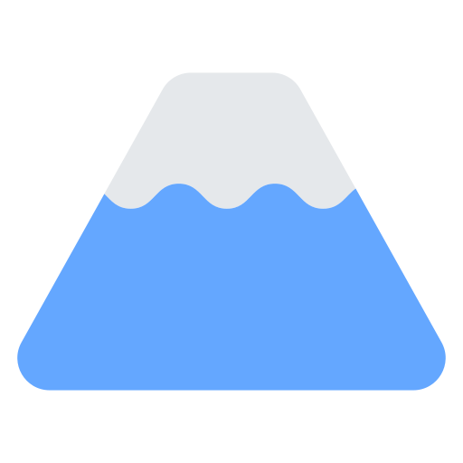

# WebWand: Vision based Full Browser Automation 🪄

[Demo](https://twitter.com/mengdi_en/status/1721965940680565166)

WebWand is a tool that redefines web interaction, making complex online tasks as simple as uttering a single command.

Crafted on top of the innovative fusion of multi-modal Large Language Models (GPT-4V), WebWand embodies a sophisticated Web AI Partner. Imagine having an intelligent companion that not only grasps your intent but also possesses a broad awareness of website content, enabling it to autonomously execute tasks on your behalf and augment your workflow. With WebWand, this vision becomes reality.

## How does it work?

WebWand leverages the power of multi-modal Large Language Model, DOM state awareness, and semantic understanding of HTML to focus on essential webpage elements while filtering out noise. 

It also features a unique "Prior Knowledge Augmentation" system that allows WebWand to navigate websites with the wisdom of collective past experiences, crowdsourced from WebWand users. 

We do NOT record your screen or collect browsing information or your prompts. It lives in your browser and uses your OpenAI key. 

## Installing and Running

### Download and Install the extension in your browser

1. Go to the [releases page](https://github.com/normal-computing/web-wand/releases), find the latest version of the extension and download "webwand.zip".
2. Unzip the file.
3. Load your extension on Chrome by doing the following:
   1. Navigate to `chrome://extensions/`
   2. Toggle `Developer mode`
   3. Click on `Load unpacked extension`
   4. Select the unzipped folder

### Use the extension

*Please note that you might need to refresh the page for the extension to work.*

1. Find the WebWand icon in the top right corner of your browser and click on it to open the sidepanel.
2. The next thing you need to do is create or access an existing [OpenAI API Key](https://platform.openai.com/account/api-keys) and paste it in the provided box. This key will be stored securely in your browser, and will not be uploaded to a third party.
3. Finally, navigate to a webpage you want WebWand and type in the task you want it to perform.

### Build the extension

If you want to build the extension from source, follow these instructions:

1. Ensure you have [Node.js](https://nodejs.org/). The developement was done on Node v20 but it should work with some lower versions.
2. Clone this repository
3. Install `pnpm` globally: `npm install -g pnpm`
4. Run `pnpm install` 
5. Run `pnpm dev` to start the development server, or `pnpm build` to build the extension.

When loading the extension, you will need to load the `dist` folder created by the build process.

## Roadmap

- Expose API for easy integration with browser automation frameworks (e.g. Puppeteer, Playwright, Selenium)
- Evaluate the performance of the WebWand in real-world scenarios
- Add support for more complex & cross-tab workflows
- Add support for more AI Models
- Add support for more browsering behaviors (select from dropdown, extract text etc.)
- Add support for saving workflows
- Add support for sharing workflows & knowledge with others
- Create wikipedia-like knowledge base where users can work together to create knowledge that can improve the WebWand's performance

## Troubleshooting

Check out our [Troubleshooting Guide](TROUBLESHOOTING.md) for help with common problems and solutions.

## Contributing

Interested in contributing to WebWand? We'd love your help! Check out our [Contribution Guide](CONTRIBUTING.md) for guidelines on how to contribute, report bugs, suggest enhancements, and more. 

We encourage everyone in the community to add new knowledge to the "Prior Knowledge Augmentation" system. Check out the default knowledge file ["db.json"](src/helpers/knowledge).

## Credits

- WebWand's image annotation method was inspired by Microsoft's [UFO paper](https://arxiv.org/abs/2402.07939).
- Web Agent as a tool that lives in browser sidepanel was inspired by [TaxyAI's browser extension](https://github.com/TaxyAI/browser-extension). We also used some of its UI code.
- The Chrome extension set-up leveraged an awesome boilerplate project [Jonghakseo/chrome-extension-boilerplate-react-vite](https://github.com/Jonghakseo/chrome-extension-boilerplate-react-vite).
- The WebWand logo was designed by [Mengdi](https://twitter.com/mengdi_en).
